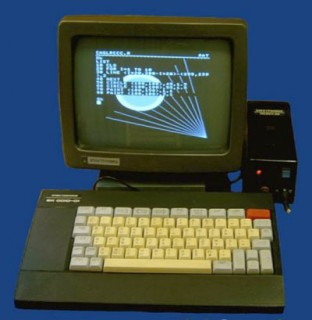

# DE0 Cyclone V

Здесь, потенциально, должны складываться различные коды процессоров и разных дебильных устройств, которые я хочу делать на ПЛИС FPGA. Это все очень неважно. В данном файле, README, ничего путного рассказано точно не будет, я обещаю вам. Это такой заполнитель текста (филлер), чтобы не скучно было открывать и читать его.

# Лицензия

Лицензия предназначена для того, чтобы лицензировать лицензированные лицензией лицензионные объекты. Вы понимаете, о чем я (смайл, который делает глазами, словно он мачо какой-то). Итак. Лицензия предназначена для того, чтобы... а для чего она вообще нужна? Не нужна она совсем. То что у меня ГНУ (согну) Генерал (мой) Паблик (вконтакте) Лицензе, ничего не значит. Это просто потому, что надо, иначе какой-нибудь гну или овцебык придет и проломит забор в Майнкрафте и начнется настоящий Лавкрафт. Спасибо. 

На этом лицензионные отчисления были закончены, а мне пора возвращаться в дурдом, за галоперидолом. Сегодня его ставят мне несколько раз. Я хорошо сплю после него.

# Зачем

Незачем. Смысл моего существования и существования этого репозитария неопределен так же, как не определено положение электрона в электронном облаке. Слишком сложно измерить положение электрона, измерив его энергию. Как-то это делают, но это слишком сложно, потому что ломать законы физики - это вам не строить здания Царства Науки. Его не построишь и за 1 000 000 (один миллион) галактических лет. Уже Вселенная успеет помереть прежде, чем будет построение Царствие Неб... научное, то есть. Вот именно поэтому я и занимаюсь этими разными делами, чтобы было всех хорошо.

Но погодите, я ведь даже не знаю, зачем я пишу этот текст, не знаю, зачем мне нужно его писать, не понимаю смысл и цель БЫТИЯ, а не то что какие-то `электронные` *прибамбасы* делать. 

# Детство, ты куда ушло

И где уютный уголок нашло? Отвечая на предыдущий абзац, или даже целых 2 абзаца, и вообще, я понял то, что совершенным образом не понял ничего. Процессоры я делаю исключительно по одной, очень простой причине:

ДЕТСТВО

А что такое детство? Когда я был без компа, в 9 лет я прочитал классную книгу по Бейсику и захотел сделать свой комп. С тех пор желание сделать свой процессор и компьютер никак не отпускает меня. А также в детстве было все самое прекрасное! Я помню, как сидел на ВЕЛИКОМ БК-0010! ГОСПОДИ! Вы просто представить не можете этого! Вы просто не понимаете, насколько это было прекрасно! Я сидел в компьютерном кружке и колпачил колпачки от клавиатуры, набивая великие программы, лучшие свои программы в жизни!

А чего стоило сидеть за УКНЦ? Божественно, просто божественно! Время было такое, невероятное, 1997 год, мне было 10 лет, а я сидел за Корветом, УКНЦ, БК-0010 и просто наслаждался, невероятно наслаждался морем компьютерного счастья. Это время никогда не вернуть.

Я хочу вернуться в свое детство. Я хочу снова ощутить тот аромат безумно бесконечного мира, свободы, снова дышать чистым и свежим воздухом, снова сидеть у компа, гулять, писать программы, быть направленным в прекрасное далёко!

Но это время ушло... ушло навсегда, и больше НИКОГДА не вернется. Не видеть больше мне солнца, реки, свободы, мира, будущего. Я полностью исчез, растворился в бесконечной грязи этого мира. Детство прекрасно, это самое лучшее время жизни. Его не вернуть, а будущее - это тлен, разложение, грязь, рабство, кандалы.

# Процессор x86 

Спустя столько лет страданий, мучений, переживаний и настоящего кошмара, я пытаюсь сделать процессор x86. И ничего не выходит. Почему так? Потому что когда я начинаю делать его, мне резко требуется зачем-то написать для него какую-то безумно крутую ОС, потом надо резко зачем-то оптимизировать долбанные инструкции, но мне нужно вовсе не это. Мне нужен не безумно скоростной суперкомпьютер, мне просто хочется, чтобы он `исполнял` гадские инструкции (тут написано любое бранное слово на ваш выбор)! Вот в чем суть всех моих метаний.

Вот что мне надо:

* Поддержка дебильного режима 16 бит
* Поддержка нормального режима 32 бит
* Поддержка режима 64 бит
* Никакой поддержки долбанных внешних устройств
* Никакой поддержки внешней памяти
* Нет никакого PIC
* Ничего нет, кроме самого процессора и его инструкции

Понимаете к чему я клоню? Я просто хочу сделать, тупо сделать процессор! И всё! Вот так вот.
